<!-- =======================================================
     ANIMATED GITHUB CONTRIBUTION HEATMAP
     Scraped live, revealed with diagonal CSS keyframe sweep
     Regenerated daily via .github/workflows/update-profile-art.yml
     ======================================================= -->

<h3><code>satyanarayana@github ~ $ ./contributions.sh</code></h3>

 
 

<!-- =======================================================
     WHOAMI: SELF-TYPING ASCII PORTRAIT + NEOFETCH INFO CARD
     Both SVGs are 840x880 for pixel-perfect symmetrical alignment
     ======================================================= -->

<h3><code>satyanarayana@github ~ $ whoami</code></h3>

<table>
  <tr>
    <td valign="top" align="center">
      
    </td>
    <td valign="top" align="center">
      
    </td>
  </tr>
</table>

 
 

<!-- =======================================================
     CONNECT & LINKS
     ======================================================= -->

<h3><code>satyanarayana@github ~ $ ./links.sh</code></h3>

<b>Backend Developer · Scalable APIs · Python & System Design</b>

 

  

 

<!-- Optional toggle/details for full metrics card -->

  
<b>📊 Click to view full analytics & monthly breakdown (<code>./stats.sh</code>)</b>

   
  

    
  

 

⭐ <i>Self-contained animated SVGs. Zero external tracking scripts. Automated via GitHub Actions.</i>

